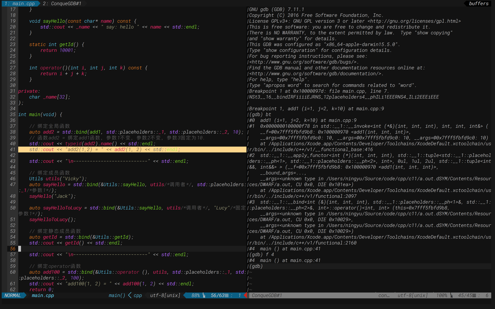

# This is syslot's vim config. 
- 部分插件和配置是从网络上找到的，如果有兴趣，用户可以依照自己的兴趣来修改使用;
- 本配置可以很好地在vim(版本高于7.4)和neovim中，但请注意你的vim需要支持python2和lua5.1;

## 功能
- 语法级提示补全，支持的语言主要有c,cpp,golang,python,java,js,tex;也有tag补全，如R，prolog等;
- git管理，如代码同步，日志，查看不同等;
- 文件可视化与查找;
- 比较漂亮的布局，高亮着色;
- 自动加载tag、cocope，可很好的帮助代码阅读;

## 安装

本教程以macOS为例;

### vim安装及插件安装
- 使用brew安装vim
> $brew install vim --with-python --with-lua__ # 安装vim,支持python&lua
- 安装vim插件管理
[Plug](https://github.com/junegunn/vim-plug)    
$curl -fLo ~/.vim/autoload/plug.vim --create-dirs \ https://raw.githubusercontent.com/junegunn/vim-plug/master/plug.vim    
:PlugInstall(在vim cmd中)   

### 插件配置
- 代码补全YouCompleteMe
> 代码补全工具使用YouCompleteMe,可支持c/cpp/go/python/js/tex等，需要编译;如果要编译速度最快，推荐使用系统内置boost&clang来进行编译     
$brew install boost clang boost-python cmake git     
$./install.py --clang-completer  --gocode-completer --system-libclang --system-boost    

- 代码调试conque-gdb
> 代码调试工具使用ConqueGdb进行调试，可在调试过程中查看源码，进行源码跳转，很方便  
$brew install gdb #(gdb 签名请google)   
$curl http://www.vim.org/scripts/download_script.php?src_id=24695 > ~/.conque_gdb.vmb && vim ~/.conque_gdb.vmb   
:so %    
:q  

- vim-go
> golang使用vim-go进行编写十分方便,直接可在vim中下载依赖文件 
:GoInstallBinaries 

- 字体补丁
> 为了在vim中使用一些比较炫的符号，在此处使用了vim-devicons组件,需要对terminal所在机器打字体补丁,详情请见[Nerd Fonts](https://github.com/ryanoasis/nerd-fonts)

- tex 自动补全

### showtime

